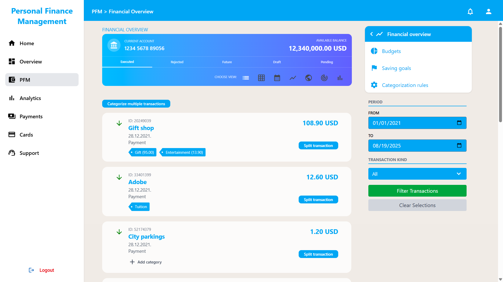
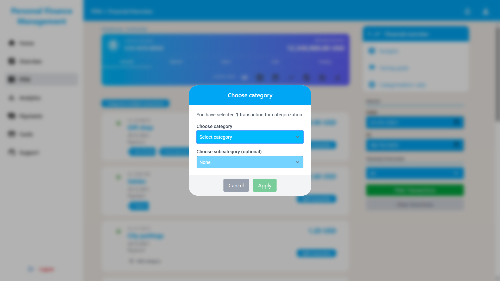
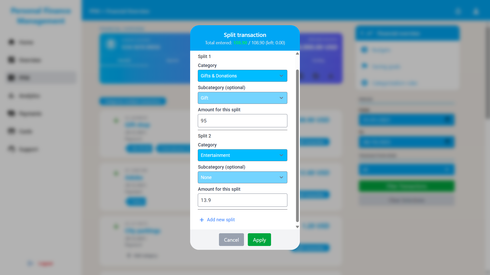
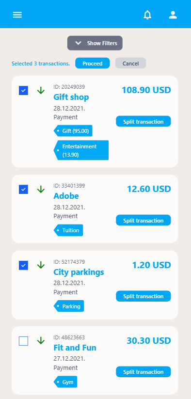
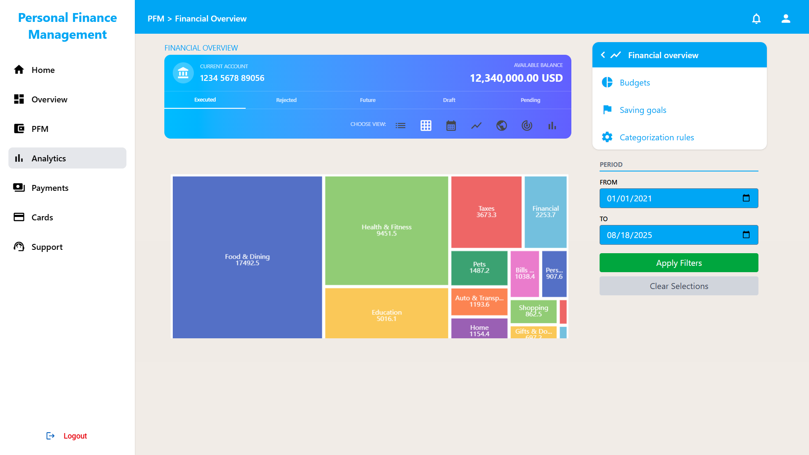

# Personal Finance Management Frontend

A modern Angular application for managing personal finances with transaction tracking, categorization, and analytics visualization.

## Contents

- [Features](#features) 
- [Tech Stack](#tech-stack)  
- [Getting Started](#getting-started)
- [Docker Support](#docker-support)   
- [Screenshots](#screenshots)  

## Features

- **Transaction Management**: View, filter, categorize, and split financial transactions
- **Analytics Dashboard**: Interactive treemap visualizations using ECharts
- **Responsive Design**: Built with Angular Material and Tailwind CSS

## Tech Stack

- **Framework**: Angular 19
- **Language**: TypeScript
- **UI Components**: Angular Material
- **Styling**: Tailwind CSS, SCSS
- **Charts**: ngx-echarts

## Getting Started

```bash
# Install dependencies
npm install

# Start development server
npm start
```

Open `http://localhost:4200` in your browser.

### Available Scripts

- `npm start` - Start development server
- `npm run build` - Build for production
- `npm test` - Run unit tests
- `npm run watch` - Build in watch mode

## Docker Support

```bash
# Build and run with Docker Compose
docker-compose up --build
```

## Screenshots


---

---

---

---
